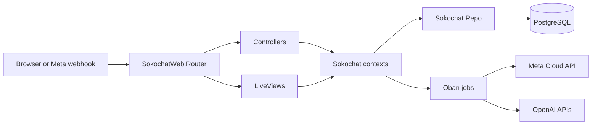

# Architecture

Sokochat is a Phoenix 1.7 LiveView app with a conventional web layer, context layer, and Ecto/PostgreSQL persistence layer.

## Request Flow

Browser requests enter `SokochatWeb.Router`. HTML pages use the `:browser` pipeline, JSON endpoints use `:api`, and authenticated LiveViews use `SokochatWeb.UserAuth` on-mount hooks. Controllers and LiveViews call context modules in `lib/sokochat/`, which own Ecto queries and schema changesets. Background work is handled by Oban workers.

## Directory Map

### `lib/sokochat/`

- `accounts.ex`, `accounts/` - users, passwords, confirmation/reset tokens, and email delivery.
- `workspaces.ex`, `workspaces/` - business workspaces owned by users.
- `catalogs.ex`, `catalogs/` - manual catalog definitions, fields, items, and catalog context for AI prompts.
- `endpoints.ex`, `endpoints/` - JSON data endpoint configuration, fetches, cached data, and refresh broadcasts.
- `cta_rules.ex`, `cta_rules/` - buyer intent rules and CTA payload forms.
- `conversations.ex`, `conversations/` - conversations, messages, PubSub topics, and dispatch helpers.
- `conversations/dispatcher.ex` - builds prompts, calls OpenAI, stores messages, and broadcasts playground replies.
- `meta.ex`, `meta/` - WhatsApp Cloud API connection records and outbound message sending.
- `ai/` - OpenAI Responses API client, embeddings, retrieval, CTA recommendation, and prompt building.
- `workers/` - Oban workers for endpoint refresh, inbound WhatsApp handling, and catalog embeddings.
- `encrypted/`, `vault.ex` - Cloak encryption types and Vault configuration.
- `repo.ex`, `postgrex_types.ex` - Ecto repo and pgvector type registration.

### `lib/sokochat_web/`

- `router.ex` - route scopes, pipelines, LiveDashboard/dev routes, auth routes, workspace routes, API routes, and webhooks.
- `user_auth.ex` - session cookies, remember-me cookies, auth plugs, and LiveView `on_mount` hooks.
- `controllers/` - auth controllers, webhook controller, JSON product test controller, and page fallback controller.
- `live/home_live/` - public marketing LiveView.
- `live/workspaces_live/` - workspace index, form, unified setup, endpoint, CTA rules, playground, and Meta pages.
- `live/playground_live.ex`, `live/playground_chat.ex` - standalone playground and shared chat/CTA rendering helpers.
- `components/`, `components/layouts/` - shared UI components and layouts.

## Tech Stack

- Phoenix and Phoenix LiveView - web framework and interactive workspace screens.
- Ecto, Postgrex, pgvector - PostgreSQL persistence and vector search over catalog items.
- Oban - scheduled endpoint refreshes, inbound WhatsApp processing, and embedding jobs.
- Req - HTTP client for JSON endpoints, OpenAI, and Meta Graph API.
- Cloak Ecto - encrypted endpoint headers and Meta access tokens at rest.
- Swoosh - account email delivery, local mailbox in development, test adapter in tests.
- Bcrypt - password hashing.
- esbuild and Tailwind - Phoenix-managed asset pipeline.
- Bandit - Phoenix endpoint adapter.

## LiveView Usage

The primary application surface is LiveView. `/workspaces` lists a user's workspaces, `/workspaces/new` and `/workspaces/:id/edit` manage workspace records, and `/workspaces/:id` provides the unified setup stepper for business profile, products, CTA rules, Meta connection, and a live WhatsApp playground. Separate LiveViews also exist for endpoint, CTA rules, Meta, and playground pages.

Playground conversations subscribe through `Sokochat.Conversations` PubSub topics. Endpoint refreshes broadcast on workspace endpoint topics so the UI can update cached-data previews.
