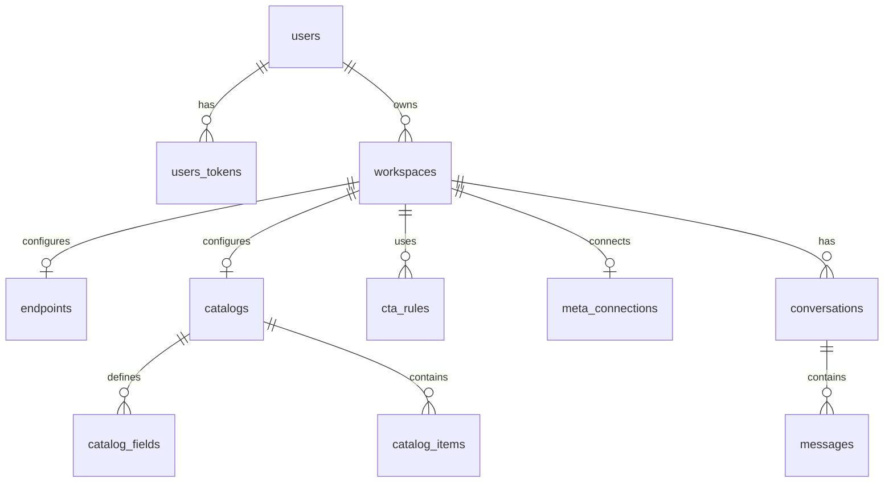

# Data Model

The data model is defined by migrations in `priv/repo/migrations/` and schemas in `lib/sokochat/`.

## Tables

### `users`

Fields: `id`, `email`, `hashed_password`, `confirmed_at`, `name`, timestamps.

Indexes: unique `email`.

### `users_tokens`

Fields: `id`, `user_id`, `token`, `context`, `sent_to`, `inserted_at`.

Indexes: `user_id`, unique `context, token`.

### `workspaces`

Fields: `id`, `name`, `slug`, `ai_instructions`, `language`, `account_id`, `data_source`, `company_name`, `industry`, `location`, `phone_number`, `about`, timestamps.

Indexes: `account_id`, unique `account_id, slug`.

Notes: `language` is one of `en`, `sw`, or `both`; `data_source` is `manual` or `api`.

### `endpoints`

Fields: `id`, `workspace_id`, `url`, `method`, `headers_encrypted`, `body_template`, `refresh_strategy`, `last_fetched_at`, `cached_data`, timestamps.

Indexes: unique `workspace_id`, `refresh_strategy`.

Notes: `method` is `GET` or `POST`; `refresh_strategy` is `on_demand`, `poll_60s`, or `poll_300s`.

### `catalogs`

Fields: `id`, `workspace_id`, `name`, `entity_label`, `context_notes`, timestamps.

Indexes: unique `workspace_id`.

### `catalog_fields`

Fields: `id`, `catalog_id`, `key`, `label`, `field_type`, `required`, `help_text`, `position`, timestamps.

Indexes: unique `catalog_id, key`, plus `catalog_id, position`.

Field types: `text`, `textarea`, `number`, `url`, `image_url`, `boolean`, `json`.

### `catalog_items`

Fields: `id`, `catalog_id`, `external_id`, `title`, `description`, `price`, `currency`, `image_url`, `url`, `phone_number`, `whatsapp_number`, `metadata`, `source`, `status`, `sort_order`, `last_synced_at`, `embedding`, `embedding_source_hash`, `embedded_at`, timestamps.

Indexes: `catalog_id, status`, `catalog_id, sort_order`, `catalog_id, inserted_at`, and `catalog_items_embedding_idx` using pgvector IVFFlat.

Notes: `source` is `manual`, `api`, or `import`; `status` is `active`, `draft`, or `archived`.

### `cta_rules`

Fields: `id`, `workspace_id`, `trigger_description`, `cta_type`, `cta_payload`, `priority`, timestamps.

Indexes: `workspace_id`, `workspace_id, priority`.

CTA types: `website`, `phone`, `whatsapp`, `reply_buttons`, `list_message`, `location`, `catalog`, `custom`.

### `meta_connections`

Fields: `id`, `workspace_id`, `phone_number_id`, `waba_id`, `access_token_encrypted`, `verify_token`, `webhook_verified_at`, `status`, `last_error`, timestamps.

Indexes: unique `workspace_id`.

Statuses: `pending`, `active`, `error`.

### `conversations`

Fields: `id`, `workspace_id`, `phone_number`, `source`, timestamps.

Indexes: `workspace_id`, unique `workspace_id, phone_number, source`.

Sources are normalized strings such as `playground` or `whatsapp`.

### `messages`

Fields: `id`, `conversation_id`, `role`, `content`, `cta`, `endpoint_snapshot`, `tokens_used`, timestamps.

Indexes: `conversation_id`, `conversation_id, inserted_at`.

Roles are normalized strings such as `user` and `assistant`.

### `oban_jobs`

Created by `Oban.Migrations.up/0`. Stores background jobs for endpoint refreshes, inbound WhatsApp processing, and embeddings.
